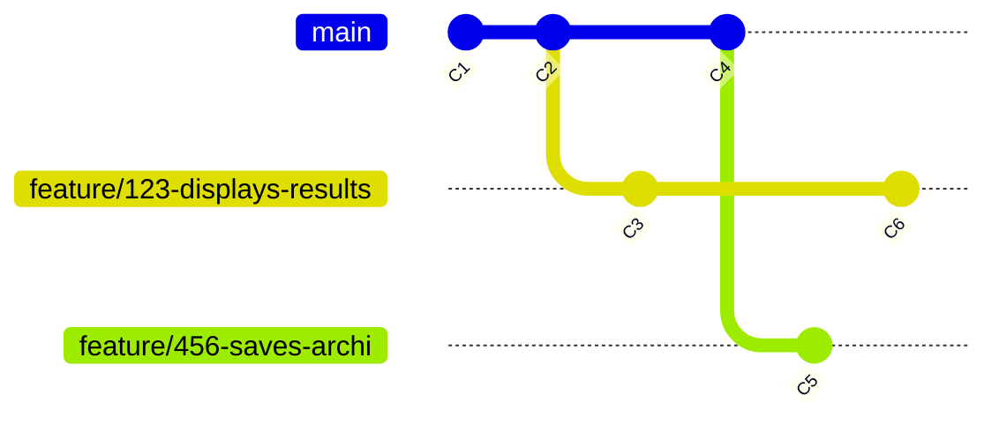
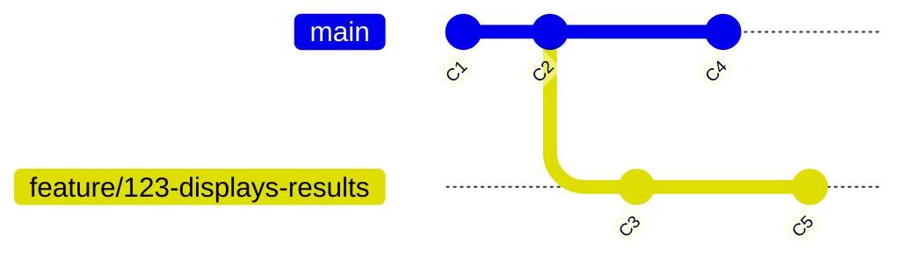
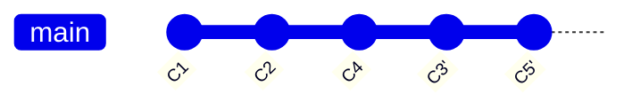
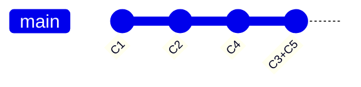

# CONTRIBUTING GUIDE

## 1. Welcome!

Thank you for considering contributing to this open source project! We welcome contributions of all kinds: code, documentation, ideas, and more.

Here are the simple yet important guidelines for this project :
- respect the [Code of conduct](../CODE_OF_CONDUCT.md)
- use github tag to mention people and not their private names
- do not mention secrets, passwords, private urls, sensitive tokens anywhere
- use English as default language everywhere

And that's pretty much it ! You are now ready to get started.

## 2. Getting Started

### 2.1. For external contributors

We use the [Forking Workflow](https://www.atlassian.com/git/tutorials/comparing-workflows/forking-workflow), used in
many open source projects. So to start contributing, please:

- Fork the repository
- Create a branch using the naming convention described below
- Make your changes
- Open a Pull Request (PR) referencing the related issue
- Ensure your changes pass all tests and checks

### 2.2. For Ippon

We use
the [Feature Branch Workflow](https://www.atlassian.com/git/tutorials/comparing-workflows/feature-branch-workflow)
according to the size of our team. Each modification will be done on a new branch created from main.



## 3. Commit Messages

We use [Conventional Commits](https://www.conventionalcommits.org/) for commit messages.

We don't document the link of the associated ticket within the commit message but **in the github description** of the issue (section "Reference issues or tasks").

**Example:**

```
feat(auth): implements login with email and password
```

It is checked in our Continous Integration.
To avoid surprised rejects, you can install [pre-commit](https://pre-commit.com) on your personal environment of development.

## 4. Branch Naming Convention

We follow the [Conventional Branches](https://conventional-branch.github.io/) naming convention to ensure clarity, traceability, and automation.

**Branch name format:**

```
<type>/<issue-number>-<short-description>
```

**Examples:**

```
feature/42-add-authentication
bugfix/108-fix-mobile-layout
docs/77-update-readme-instructions
```

**Rules:**

- Use a predefined type (see below)
- Always include the related issue number
- Use kebab-case for short, meaningful description

**Allowed types:**

- `feature`: For new features (e.g., feature/add-login-page)
- `bugfix`: For bug fixes (e.g., bugfix/fix-header-bug)
- `hotfix`: For urgent fixes (e.g., hotfix/security-patch)
- `release`: For branches preparing a release (e.g., release/v1.2.0)
- `chore`: Maintenance tasks

### 4.1. Why This Convention Matters

- 🔍 **Clarity**: It’s easy to understand the purpose of a branch.
- 🔗 **Traceability**: The issue number links code to its discussion and context.
- ⚙️ **Automation**: Tools like `commit-check` and `commit-check-action` can verify branch names and enforce consistency.

## 5. Merge convention

In the project, the pull request will be rebased and merge fast-forward.



will be merged in:



or if squash is activated:



## 6. Tools & Checks

To help enforce the rules, we use:

- For conventional commits:
  - [commit-check](https://github.com/commit-check/commit-check)
  - [commit-check-action](https://github.com/commit-check/commit-check-action)
- For secret passwords: [gitleaks](https://github.com/gitleaks/gitleaks/blob/master/README.md#pre-commit)

These tools will validate branch names and commit messages during pull requests.

## 7. Need Help?

If you have any questions or need assistance, feel free to open an issue or join the project discussion board. We’re happy to help!
