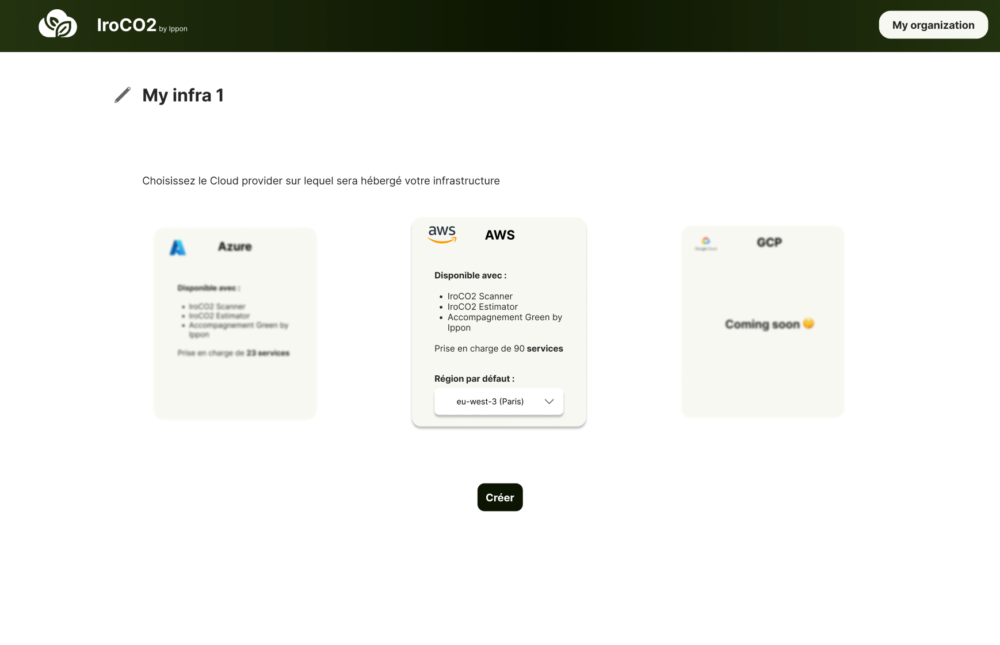

# Carbon Footprint Calculator

> This section needs to be updated.

## Creating an infrastructure

On your user space,
1. Go to *My infrastructures*
2. Choose *New Infrastructure*
3. Configure your infrastructure by choosing
   * a name
   * a cloud provider compatible with IroCO2
   * and a default region on which you want to configure your components.

## Adding components

In order to represent the cloud resources that are or will be present on your infrastructure,
you need to create components that summarize the configuration elements of a resource (vCPUs, memory, storage, etc...),
as well as usage configuration elements (usage time, replication, etc...).

You can, if you want, configure a component with an alternative region to the default one of your infrastructure.

On the *infrastructure designer*, select *New component* and choose the service to configure (for example: EC2, Lambda, etc...).

## Estimating the carbon footprint

The carbon footprint estimation of an infrastructure will give you access to the following information:

- **Monthly carbon footprint forecast** : A CO2eq mass forecast over a period of one month
- **A comparison aid** : It will be easier to understand the magnitude of the carbon footprint impact
   of the changes made to your infrastructures with comparisons to everyday actions
   (car/air travel, heating, etc...)
- **A ranking of the most emitting resources** : To better focus your improvement efforts
- **Alternative region proposals** : A comparison of nearby regions based on financial and environmental differences
to help you make migration decisions.

## Reducing your carbon footprint

For each of the cloud services compatible with IroCO2, you can refer to the *Availability catalog* to find levers of action
to start eco-designing your infrastructure and reduce its carbon footprint.